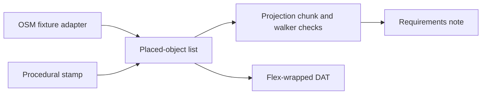
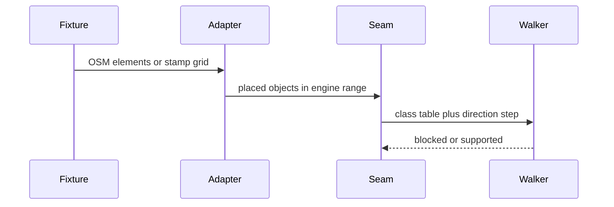

# U8 Isometric Map Modularity Evaluation - Plan

## Goal Capsule

**Objective.** Prove, with headless tests, the isometric layout and world range Ultima VIII uses, and compare an OSM index with a procedural stamp through one placed-object list and a stand-in walker.

**Authority.** Product Contract requirements win on behavior. Key Technical Decisions win on mechanism inside those requirements. A unit does not override either.

**Stop conditions.** Stop if a change needs a Pentagram binary, a display, proprietary Pagan static files, or the facial avatar mesh in `engines/avatar`. Stop if the only way to state a requirement is to claim the engine loaded a generated map.

**Execution profile.** Characterize the current Python U8 writer against copied engine constants, then change the writer so both sources satisfy those constants.

**Tail ownership.** Implementation follows the units below. This document does not launch a separate goal session.

## Product Contract

### Summary

Add a headless evaluation in the existing Python U8 exporter. An OSM fixture and a small procedural stamp both emit one placed-object list. Tests check isometric projection, the 64 by 64 chunk index, terrain class, and a synthetic walk step. A short requirements note records which seams are shared and what still blocks a Pentagram load.

### Problem Frame

Ultima VIII maps are lists of 3D items, not a terrain grid. The Python exporter already writes U8 object records, but it scales the world to 65536 and leaves the Flex title bytes as zeros, so `FlexFile::isFlexFile` rejects the file. `engines/avatar` deforms a face. It does not walk a map. A shared object list lets both sources be checked. The walker applies terrain class stored on those objects. Matching walker results do not show that the sources assign classes from OSM tags the same way.

### Requirements

#### Layout

- R1. Isometric screen position uses `screen_x = (x - y) / 4` and `screen_y = (x + y) / 8 - z`, with signed integer division that truncates toward zero.
- R2. Each object bins to chunk `(x // 512, y // 512)` inside a 64 by 64 grid, and world `x` and `y` satisfy `0 <= coord < 32768`.

#### Terrain and movement

- R3. Terrain class comes from an explicit table of land, water, path, and solid. The 16-byte record flags field is not the collision source.
- R4. A synthetic walker takes one frame with `deltadir = 1` using the eight direction factors. Land and path support the step. Water blocks it. A solid supports the step when its top `z` equals the walker's `z`. A solid blocks the step when the step overlaps that solid's volume.

#### Sources

- R5. An OSM fixture and a procedural stamp both produce the same placed-object list type.
- R6. Objects from both sources use 128-unit procedural spacing where the procedural stamp places them, and every emitted world coordinate obeys R2.

#### Archive and evaluation

- R7. Exported `FIXED.DAT` and `NONFIXED.DAT` pass a Python Flex check: `0x1A` padding through the name field, and a little-endian count at offset `0x54`.
- R8. A requirements note names the shared seam, the engine-specific seam, the OSM adapter, the procedural adapter, and the remaining Pentagram load blockers.

### Actors

- A1. A developer running the OSM2Ultima test suite, with no network and no game data.

### Flows

- F1. A1 runs the Python tests. The suite builds an OSM placed-object list and a procedural placed-object list, checks R1 through R7, and leaves R8's note in the tree.
- F2. The walker reads each source list on its own and applies R3 and R4 to classes already stored on those objects. The same stored classes produce the same pass or block result. That agreement does not show that the sources assign classes the same way.

### Acceptance Examples

- AE1. Covers R1, R2. An object at `(512, 0, 0)` is chunk `(1, 0)`, `screen_x = 128`, and `screen_y = 64`. An object at `(511, 511, 0)` is chunk `(0, 0)`. An object at `(0, 1, 0)` has `screen_x = 0` and `screen_y = 0`.
- AE2. Covers R3, R4. From a land object, a step onto path is accepted, a step onto water is rejected, a step onto a solid floor whose top `z` equals the walker's `z` is accepted, and a step that overlaps a solid volume is rejected. Record flags stay `0`.
- AE3. Covers R5, R6. Both sources emit only coordinates in `[0, 32768)`. The procedural stamp places neighbors 128 units apart.
- AE4. Covers R7. The first 82 bytes of an exported DAT are `0x1A`, and the uint32 at offset `0x54` is the entry count.

### Scope Boundaries

In scope: Python tests and the U8 exporter changes those tests require. The world range in R2. An in-place Flex title of `0x1A` on the existing header, with the index at offset 128 still pointing at raw object records. A synthetic walker. The requirements note in R8.

Out of scope: compiling or running Pentagram, `engines/avatar`, live Overpass fetches, U7 IREG chunks, swimming, and any claim that Pentagram loaded the file.

### Deferred to Follow-Up Work

- Load a generated map in Pentagram after real `fixed.dat`, `typeflag.dat`, and `u8shapes.flx` are available.
- Verify placeholder shape numbers against `typeflag.dat`.
- Emit U8 globs.
- Resample OSM building and road geometry onto a 128-unit grid. This plan only requires 128-unit spacing from the procedural stamp (R6).

### Success Criteria

The OSM2Ultima pytest suite passes, including the new cases for AE1 through AE4. The requirements note exists and lists the five headings in R8. No test imports `engines/avatar` or starts Pentagram.

## Planning Contract

### Key Technical Decisions

- KTD1. The harness lives in `tools/osm2ultima` and its pytest suite. It copies engine literals into Python. It does not link Pentagram or `engines/avatar`. Governs R1, R4, R8.
- KTD2. Valid world coordinates are `0 <= x, y < 32768`. `U8CoordinateTransformer` uses that span and clamps. OSM way and building sample steps stay as they are. Governs R2, R6.
- KTD3. The walker reads a terrain-class table keyed by class, not `U8Object.flags`. Land and path support. Water is blocked. A solid floor supports when its top `z` equals the walker's `z`. An overlapping solid blocks. One frame uses `deltadir = 1`. Governs R3, R4.
- KTD4. The shared type is a placed object that can become a `U8Object`. OSM fixed objects and the procedural stamp are adapters into that type. The walker reads each source's placed-object list on its own. Governs R5.
- KTD5. The exported DAT is the Flex archive. Stamp `0x1A` across the first `0x52` bytes of the existing 128-byte header. Write the map-slot count as a uint32 at offset `0x54`. Leave the index at offset `0x80` pointing at raw 16-byte object records. Do not nest a second header inside a Flex member. A Python predicate mirrors `FlexFile::isFlexFile` and the uint32 count. Governs R7.
- KTD6. Engine literals live in one Python module with comments pointing at `engines/ultima8/world/CurrentMap.h`, `engines/ultima8/misc/Direction.h`, `engines/ultima8/graphics/ShapeInfo.h`, and `engines/ultima8/docs/u8mapfmt.txt`. Governs R1, R2, R4.

### High-Level Technical Design

### Assumptions

- Headless mode settled these without a scoping confirmation.
- Proprietary Pagan static data is absent, so collision uses synthetic classes (KTD3).
- Empty OSM input is valid and yields an empty placed-object list.
- `U8CoordinateTransformer` clamps OSM coordinates that would fall outside R2 (KTD2). The layout helper rejects or flags those coordinates (U1). The walker rejects a step that would leave R2 (U4).
- An object at exactly 512 belongs to chunk 1.
- Diagonal steps move on both axes. That matches `deltadir = 1` on a diagonal factor pair.
- Each placed object owns the half-open square `[x, x+128)` by `[y, y+128)`. The walker reads the class of the square that contains the destination. Support means that square's top `z` equals the walker's `z`. A square with no object rejects the step.
- Generator tests set `random.seed(0)` or inject the shape picker.
- The requirements note lives at `docs/u8_map_modularity.md` and is linked from `tools/osm2ultima/README.md`.
- Existing OSM sample density is unchanged (KTD2). A full-city resample is deferred.

### Sequencing

U1 locks the constants and the projection, chunk, and range checks. U2 changes the transformer so OSM coordinates satisfy R2. U3 adds the Flex wrapper. U4 adds the walker. U5 feeds both adapters through U4. U6 writes the note those tests make true.

## Implementation Units

### U1. Engine constants and layout checks

**Goal.** Copy the engine literals and test projection, chunk bins, and the world range before later units depend on them.

**Requirements.** R1, R2.

**Dependencies.** None.

**Files.**
- `tools/osm2ultima/u8_engine_constants.py`
- `tools/osm2ultima/tests/test_u8_layout.py`

**Approach.**
- Add the constant module described by KTD6.
- Test AE1 and the corners `(0, 0, 0)` and `(32767, 32767, 0)`.
- Assert `(32768, 0)` is not a valid world coordinate under R2.
- Implement screen conversion with truncation toward zero, not Python floor division.
- Assert `(0, 1, 0)` yields `screen_x` 0 and `screen_y` 0.
- Assert `(0, 4, 0)` yields `screen_x` -1.
- Assert a non-zero `z` lowers `screen_y`.

**Execution note.** Write these tests against the constant module first. Do not change the exporter in this unit.

**Patterns to follow.** `tools/osm2ultima/tests/test_u8_format.py` uses `unittest` style cases under pytest.

**Test scenarios.**
- Happy path: `(512, 0, 0)` yields chunk `(1, 0)`, `screen_x` 128, and `screen_y` 64.
- Happy path: `(511, 511, 8)` yields chunk `(0, 0)` and `screen_y` 119.
- Edge: `(0, 1, 0)` has `screen_x` 0. `(0, 4, 0)` has `screen_x` -1.
- Edge: `(0, 0, 0)` is chunk `(0, 0)`. `(32767, 32767, 0)` is chunk `(63, 63)`.
- Edge: `(512, 512, 0)` is chunk `(1, 1)`.
- Error: a helper rejects or flags `x = 32768` and `x = -1` as outside R2.

**Verification.** The new layout tests pass without importing the exporter.

### U2. Clamp OSM coordinates to the engine span

**Goal.** Make the OSM coordinate transformer emit only R2 coordinates.

**Requirements.** R2, R6.

**Dependencies.** U1.

**Files.**
- `tools/osm2ultima/u8_shape_mapping.py`
- `tools/osm2ultima/u8_format.py`
- `tools/osm2ultima/tests/test_u8_format.py`
- `tools/osm2ultima/tests/test_u8_layout.py`

**Approach.**
- Apply KTD2 to `U8CoordinateTransformer` and to `convert_osm_to_u8_coords`.
- Update existing assertions that expect a 65535 cap or a 256 tile size where those helpers are the subject.
- Leave OSM way and building sample steps unchanged.
- A degenerate bbox still maps with the existing center fallback, and the result stays inside R2.

**Execution note.** Characterize the current 65536 span with one failing assertion, then change the transformer.

**Patterns to follow.** Existing clamp in `U8CoordinateTransformer.osm_to_u8`.

**Test scenarios.**
- Happy path: normalized `(0, 0)` maps to `(0, 0)`. Normalized `(1, 1)` maps to `(32767, 32767)`.
- Edge: a bbox with zero longitude span still returns a coordinate inside R2.
- Edge: input that previously scaled near 65535 now clamps to 32767.
- Integration: `convert_osm_to_u8_coords` for a tile index uses the updated cap. Existing round-trip object tests still pack `x` and `y` as uint16.

**Verification.** Layout and format tests pass. A scan of transformer output from a tiny in-memory OSM dict finds no coordinate at or above 32768.

### U3. Flex wrapper around the inner map header

**Goal.** Make exporter DAT files satisfy R7 by fixing the existing header in place.

**Requirements.** R7.

**Dependencies.** U1.

**Files.**
- `tools/osm2ultima/u8_format.py`
- `tools/osm2ultima/osm2u8.py`
- `tools/osm2ultima/tests/test_u8_format.py`

**Approach.**
- Apply KTD5 to the existing writer. Do not add a nested Flex member around the current header.
- Write the map-slot count as a uint32 at offset `0x54`.
- The reader resolves each map with the offset and size pair at `0x80 + 8 * index` and parses 16-byte object records from that payload.

**Patterns to follow.** `engines/ultima8/filesys/FlexFile.cpp` for the `0x1A` run, the uint32 count at `0x54`, and the index at `0x80`.

**Test scenarios.**
- Happy path: a one-object map round-trips shape, frame, and coordinates. The payload is raw object bytes, not a second header. Covers AE4.
- Happy path: map 0 holds the objects and the other map slots stay empty inside the same file.
- Edge: an empty object list still writes one file whose uint32 at `0x54` is the map-slot count, including empty slots.
- Error: a buffer of zeros fails the Flex predicate.
- Integration: existing size checks still see a 128-byte header plus the index and the object bytes.

**Verification.** Format tests pass for the in-place Flex header and the raw object payloads.

### U4. Terrain table and synthetic walker

**Goal.** Step a walker from terrain class, independent of record flags.

**Requirements.** R3, R4.

**Dependencies.** U1.

**Files.**
- `tools/osm2ultima/u8_walk.py`
- `tools/osm2ultima/tests/test_u8_walk.py`

**Approach.**
- Define the placed-object fields the walker reads in `tools/osm2ultima/u8_walk.py`: world coordinates, top `z`, and terrain class.
- Apply the occupancy square from Assumptions and the support rule in KTD3.
- Direction factors come from the U1 constant module. A cardinal step moves 4 world units on one axis.
- Class-changing cases start four units before a square boundary so one frame crosses it.
- A step that would leave R2 is rejected.
- The destination square decides the result, including when that square is in another chunk.

**Patterns to follow.** Direction tables in `engines/ultima8/misc/Direction.h`. Support idea in `CurrentMap::isValidPosition`, simplified to KTD3.

**Test scenarios.**
- Happy path: land to path is accepted. Covers AE2.
- Happy path: land to a solid floor at the same top `z` is accepted.
- Happy path: land to land at the same `z` is accepted.
- Edge: a diagonal step changes both `x` and `y`.
- Edge: `deltadir` is fixed at 1, so a cardinal step is 4 world units on one axis.
- Error: a step that overlaps a solid volume is rejected. Land to water is rejected. Record flags are 0 in every case.
- Error: a destination square with no object is rejected.
- Error: a step that would set `x` to 32768 is rejected.

**Verification.** Walker tests pass without reading `U8Object.flags` for the decision.

### U5. OSM and procedural adapters

**Goal.** Drive the walker from both sources through one placed-object list.

**Requirements.** R5, R6.

**Dependencies.** U2, U4.

**Files.**
- `tools/osm2ultima/u8_sources.py`
- `tools/osm2ultima/osm2u8.py`
- `tools/osm2ultima/tests/test_u8_sources.py`
- `tools/osm2ultima/test_osm_data.json` only if a smaller inline fixture is not enough

**Approach.**
- Adapt `U8MapGenerator` fixed objects and the procedural stamp into the placed-object type defined in U4.
- Add a procedural stamp that fills a small grid at 128-unit spacing from an origin of `(0, 0)`, with `random.seed(0)`.
- Build the same land, path, solid, and water pattern once from the stamp and once from hand-built OSM elements, then expect the same walker results.
- Do not call the network. Do not import `engines/avatar`.

**Patterns to follow.** In-memory OSM dicts and `skipTest` when `test_osm_data.json` is absent, in `tools/osm2ultima/tests/test_osm2ultima.py`.

**Test scenarios.**
- Happy path: the procedural stamp's neighbor delta is 128 on each axis. Covers AE3.
- Happy path: a tiny OSM way and the matching stamp both block on solid and accept path.
- Edge: OSM `elements: []` yields an empty list.
- Edge: a way whose node id is missing is skipped, and the rest of the list is still in range.
- Error: the OSM adapter does not fetch. A test patches or avoids `OSMFetcher`.
- Integration: every object from both adapters satisfies R2.

**Verification.** Source tests pass offline. The two constructed maps agree on walker outcomes for the four classes.

### U6. Modularity requirements note

**Goal.** Record what the tests established, including what they do not prove.

**Requirements.** R8.

**Dependencies.** U3, U5.

**Files.**
- `docs/u8_map_modularity.md`
- `tools/osm2ultima/README.md`
- `tools/osm2ultima/tests/test_u8_modularity_note.py`

**Approach.**
- Write the note with five headings: shared seam, engine-specific seam, OSM adapter, procedural adapter, Pentagram load blockers.
- State that shape numbers are placeholders, object flags are not collision, globs are absent, and Pentagram was not executed.
- Link the note from the U8 section of the OSM2Ultima README.
- The test only checks that those headings exist.

**Patterns to follow.** Tone of `docs/world_map_structure.md` and `docs/gis_format_comparison.md`.

**Test scenarios.**
- Happy path: the note file contains the five headings named above.
- The automated test only checks that the five headings exist. The note states that Pentagram was not executed and does not claim Pentagram loaded a generated map.

**Verification.** The heading test passes, and the README links to `docs/u8_map_modularity.md`.

## Verification Contract

Run the OSM2Ultima suite from `tools/osm2ultima` with pytest over `tests/`. That is the same suite the `test-osm2ultima` CI job runs. All new tests live in that directory and must pass with the existing ones.

No Pentagram configure, no avatar CTest, and no network call is a gate for this plan.

## Definition of Done

- U1 through U6 are present and their test scenarios pass.
- AE1 through AE4 hold in the suite.
- `docs/u8_map_modularity.md` lists the five R8 headings and does not claim an engine load.
- Abandoned experiments and unused generators are not left in the diff.
- `engines/avatar` and `engines/ultima8` sources are unchanged.

## Risks and Dependencies

- Placeholder shape ids in `tools/osm2ultima/u8_shape_mapping.py` remain unverified. The note must say so. Tests must not treat those ids as collision.
- Changing the world span changes coordinates of any previously generated U8 map. The inner record format stays uint16, so old readers of the inner header still parse.
- The Flex wrapper changes exporter bytes. Inner-only tests must keep using the inner writer (U3).
- `random.choice` in the U8 generator can make source tests flake unless the seed or picker is fixed (Assumptions).

## Sources and Research

- `engines/ultima8/world/CurrentMap.h` defines `MAP_NUM_CHUNKS` as 64. Chunk size for U8 is 512 in `engines/ultima8/world/CurrentMap.cpp`.
- `engines/ultima8/docs/u8mapfmt.txt` records the isometric formula.
- `engines/ultima8/misc/Direction.h` records the eight direction factors.
- `engines/ultima8/filesys/FlexFile.cpp` records the Flex magic and count placement.
- `tools/osm2ultima/u8_shape_mapping.py` currently defaults `world_width` to 65536.
- `tools/osm2ultima/u8_format.py` writes a zeroed inner header and a uint16 count.
- `docs/world_map_structure.md` separates U8 item collision from U7 tile terrain.
- `docs/avatar_motion_mesh.md` describes facial motion, not world locomotion.
- `docs/gis_format_comparison.md` treats GeoJSON as an inspection sidecar, not a game map.
- No `docs/solutions/` corpus exists. External research was not required. The exporter and the engine constants are already in the tree.
